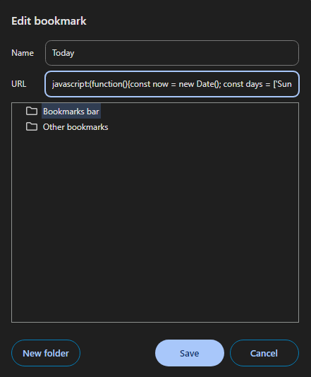
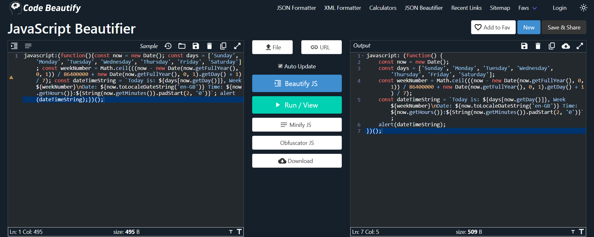

# DOMBS - DOMinator Bookmark Suite

**DOMBS (DOMinator Bookmark Suite)** is a collection of useful JavaScript bookmarklets designed to dominate your browser's DOM. Automate repetitive tasks, manipulate webpage elements, and customize your browsing experience — all with just a click. Whether you want to remove pesky ads, change the look of a webpage, or automate button clicks, DOMBS has the perfect set of tools to help you take control of your web environment quickly and efficiently. Ideal for developers, productivity enthusiasts, and anyone who wants to transform the way they interact with webpages.

## Table of Contents

- [Features](#features)
- [Usage](#usage)
- [Available Bookmarklets](#available-bookmarklets)
- [Documentation](#documentation)
- [Contributing](#contributing)
- [License](#license)

## Features

- **One-Click Automation**: Easily automate repetitive web tasks with pre-built JavaScript bookmarklets.
- **DOM Manipulation**: Quickly modify, remove, or edit elements on any webpage.
- **Enhanced Browsing**: Customize the look and feel of webpages to suit your preferences.
- **Developer-Friendly**: Bookmarklets are well-documented, and a formatted version of each script is provided for customization.

## Usage

Each JavaScript bookmarklet in **DOMBS** is designed to perform a specific action, such as:

- Removing specific HTML elements.
- Changing the styling of a page.
- Automatically clicking on buttons.
- Automating navigation or content downloads.

Example:

Here is a one-line JavaScript bookmarklet that you can save as a bookmark to provide a quick overview of today's date details in an alert box:

```js
javascript:(function(){const now = new Date(); const days = ['Sunday', 'Monday', 'Tuesday', 'Wednesday', 'Thursday', 'Friday', 'Saturday']; const weekNumber = Math.ceil(((now - new Date(now.getFullYear(), 0, 1)) / 86400000 + new Date(now.getFullYear(), 0, 1).getDay() + 1) / 7); const dateTimeString = `Today is: ${days[now.getDay()]}, Week ${weekNumber}\nDate: ${now.toLocaleDateString('en-GB')} Time: ${now.getHours()}:${String(now.getMinutes()).padStart(2, '0')}`; alert(dateTimeString);})();
```

> **Note**: All JavaScript will look like this in the bookmarklet form. For better readability, the full, well-formatted version along with proper documentation is available in the src folder.

### Installation

First, make sure the bookmark bar is visible in your browser. It give a better user experience. Then follow the instructions bellow:

1. Find the bookmarklet you want to add as bookmark.
2. Copy the javascript code, exactly as it is. 
3. Open the a new bookmark panel. 
4. In the name field, enter the name bookmarklet
5. Past the javascript code in the URL field.

The following is how it looks like in Google Chrome. If you have questions how to add a new bookmark on Google Chrome or other browsers, click [here](./docs/howtos/bookmarks.md).
<div style="text-align: center;">
    
</div>

## Available Bookmarklets

The full list bookmarklets included in **DOMBS** is listed in the [`bookmarklets` index](./docs/index.md).

## Documentation

A full, well-formatted version of the JavaScript code with inline comments explaining how it works can be found at [`src` folder](./src/).

## Contributing

Please refer to our [contributing guidelines](./CONTRIBUTING.md) for more details.

## License

This project is licensed under the MIT License. See the [LICENSE](./LICENSE) file for more details.

## Disclaimer

The author of this repository is not responsible for any implications resulting from the use of the provided bookmarklets. Users are advised to exercise caution and discretion while using these scripts. If you have questions regarding the legality of using these bookmarklets or if they may potentially break any laws, it is strongly recommended that you refrain from using them.

If you have questions about the code, you can use online tools such as [Code Beautify's JS Viewer](https://codebeautify.org/jsviewer/) to format the bookmarklet code and compare it with the provided formatted version.
<div style="text-align: center;">
    
</div>

By using these bookmarklets, you acknowledge that you do so at your own risk.

