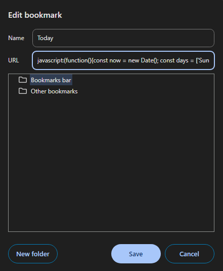

# Adding bookmarks ⭐

## Bookmark bar
First, you need make sure the bookmark bar is visible in your browser. Here are step-by-step instructions on how to show the bookmark bar in Google Chrome, Firefox, and Microsoft Edge:

### Google Chrome 

1. **Open Google Chrome**: Launch the Chrome browser on your computer.

2. **Access the Menu**: Click on the three vertical dots (⋮) located in the top-right corner of the browser window.

3. **Show Bookmarks Bar**: 
   - Hover over **Bookmarks** in the dropdown menu.
   - In the submenu, click on **Show bookmarks bar** to enable it. A checkmark will appear next to this option, indicating that the bookmarks bar is now visible.

4. **Alternative Method**: You can also toggle the bookmarks bar on and off by pressing `Ctrl + Shift + B` (Windows) or `Cmd + Shift + B` (Mac).

### Mozilla Firefox 

1. **Open Mozilla Firefox**: Launch the Firefox browser on your computer.

2. **Access the Menu**: Click on the three horizontal lines (☰) in the top-right corner of the browser window.

3. **Show Bookmarks Toolbar**: 
   - Click on **Bookmarks** in the dropdown menu.
   - Then select **Bookmarks Toolbar** and click on **Always Show**. 

4. **Alternative Method**: You can also toggle the bookmarks toolbar by right-clicking on an empty space in the toolbar area, then clicking on **Bookmarks Toolbar** and selecting **Always Show**.

5. **Shortcut**: You can press `Ctrl + B` (Windows) or `Cmd + B` (Mac) to open the bookmarks sidebar.

### Microsoft Edge 

1. **Open Microsoft Edge**: Launch the Edge browser on your computer.

2. **Access the Menu**: Click on the three horizontal dots (⋮) in the top-right corner of the browser window.

3. **Show Favorites Bar**: 
   - Hover over **Favorites** in the dropdown menu.
   - Click on **Show favorites bar** and choose **Always** from the submenu.

4. **Alternative Method**: You can also toggle the favorites bar on and off by pressing `Ctrl + Shift + B` (Windows) or `Cmd + Shift + B` (Mac).

### Summary
By following these steps, you will enable the bookmarks bar in Google Chrome, Firefox, and Microsoft Edge, allowing you to easily access your bookmarks at any time. Happy browsing!

## Adding a new bookmark

Here are step-by-step instructions for adding a new bookmark in Google Chrome, Firefox, and Microsoft Edge, specifically for manually entering the name and URL of the bookmark:

### Google Chrome 

1. **Open Google Chrome**: Launch the Chrome browser on your computer.

2. **Show the Bookmarks Bar**: Ensure that the bookmarks bar is visible by following the steps mentioned previously.

3. **Open the Bookmark Manager**:
   - Right-click on an empty space in the bookmarks bar.
   - Select **Add new bookmark** from the context menu.
  
   Alternatively:
   - Click the three vertical dots (⋮) in the top-right corner.
   - Go to **Bookmarks** > **Bookmark manager** (or press `Ctrl + Shift + O`).
   - In the bookmark manager, click on the three vertical dots (⋮) in the top-right corner, and select **Add new bookmark**.

4. **Enter Bookmark Details**:
   - **Name**: In the **Name** field, , enter bookmarklet name (this is how it will appear on the bookmarks bar).
   - **URL**: In the **URL** field, paste the bookmarklet (`javascript:(function...`).

<div style="text-align: center;">
    
</div>

5. **Save the Bookmark**: Click the **Save** button to add the bookmark to your bookmarks bar.

<div style="text-align: center;">
    
</div>

### Mozilla Firefox 

1. **Open Mozilla Firefox**: Launch the Firefox browser on your computer.

2. **Show the Bookmarks Toolbar**: Ensure that the bookmarks toolbar is visible by following the steps mentioned previously.

3. **Open the Bookmark Manager**:
   - Right-click on an empty space in the bookmarks toolbar.
   - Select **New Bookmark** from the context menu.
   
   Alternatively:
   - Click on the three horizontal lines (☰) in the top-right corner.
   - Go to **Library** > **Bookmarks** > **Show All Bookmarks** (or press `Ctrl + Shift + B`).
   - In the Library window, click on the **Import and Backup** button, then select **Add Bookmark**.

4. **Enter Bookmark Details**:
   - **Name**: In the **Name** field, enter bookmarklet name (this is how it will appear on the bookmarks bar).
   - **URL**: In the **URL** field, paste the bookmarklet (`javascript:(function...`).

<div style="text-align: center;">
    
</div>   

5. **Save the Bookmark**: Click the **Save** button to save the bookmark.

<div style="text-align: center;">
    
</div>

### Microsoft Edge 

1. **Open Microsoft Edge**: Launch the Edge browser on your computer.

2. **Show the Favorites Bar**: Ensure that the favorites bar is visible by following the steps mentioned previously.

3. **Open the Favorites Panel**:
   - Type the following address in the address bar:
   ```edge://favorites/?id=1```
   - Select **Add new favorite** from the context menu.
   
   Alternatively:
   - Click on the three horizontal dots (⋮) in the top-right corner.
   - Go to **Favorites** > **Manage favorites** (or press `Ctrl + Shift + O`).
   - In the favorites panel, click on the **Add new favorite** button (star icon).

<div style="text-align: center;">
    
</div>      

4. **Enter Bookmark Details**:
   - **Name**: In the **Name** field, enter bookmarklet name (this is how it will appear on the bookmarks bar).
   - **URL**: In the **URL** field, paste the bookmarklet (`javascript:(function...`).

<div style="text-align: center;">
    
</div>       

5. **Save the Bookmark**: Click the **Save** button to add the bookmark to your favorites bar.

<div style="text-align: center;">
    
</div> 

### Summary

By following these steps, you can manually add a new bookmark in Google Chrome, Firefox, and Microsoft Edge, entering your desired name and URL. This method is useful for saving links that are not currently open in your browser. Happy bookmarking!