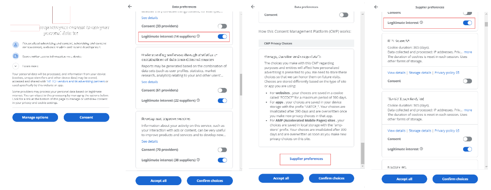

# DOMBS Bookmarklets Documentation

Welcome to the **DOMBS Bookmarklets Documentation**. This file contains all the bookmarklets included in the **DOMinator Bookmark Suite**. You can easily copy the code for each bookmarklet and add it as a new bookmark in your browser to enhance your web experience.

## How to Use This Documentation

For each bookmarklet, you will find:
- **Title**: The name of the bookmarklet.
- **Description**: A brief explanation of what the bookmarklet does.
- **Code**: The JavaScript code to be copied and saved as a bookmark.

To make things convenient both name and code are formatted for easy copying.

### Installation

First, make sure the bookmark bar is visible in your browser. It give a better user experience. Then follow the instructions bellow:

1. Find the bookmarklet you want to add as bookmark.
2. Copy the code, exactly as it is.
3. Open the a new bookmark panel.
4. In the name field, enter the name bookmarklet
5. Past the code in the URL field.

Feel free to explore and adapt the bookmarklets to your needs for even more productive automation!

## Bookmarklets List

### Today 📅

**Description**: This bookmarklet displays the current date and time in 24-hour format, along with the name of the week day and the current week number. It provides a quick overview of today's date details in an alert box.

**Name**:
```
Today 📅
```

**Code**:
```js
javascript:(function(){const now = new Date(); const days = ['Sunday', 'Monday', 'Tuesday', 'Wednesday', 'Thursday', 'Friday', 'Saturday']; const weekNumber = Math.ceil(((now - new Date(now.getFullYear(), 0, 1)) / 86400000 + new Date(now.getFullYear(), 0, 1).getDay() + 1) / 7); const dateTimeString = `Today is: ${days[now.getDay()]}, Week ${weekNumber}\nDate: ${now.toLocaleDateString('en-GB')} Time: ${now.getHours()}:${String(now.getMinutes()).padStart(2, '0')}`; alert(dateTimeString);})();
```
---

### YT Speed Boost 🚀

**Description**: This bookmarklet allows you to watch YT videos at an increased speed to 8x. Use it to fast-forward videos quickly and get through content more efficiently. You can modify the playbackRate with values from 0.1 to 15.9 and have different bookmarks for each value. Values equal or grater than 16x seem to have effect for a short time.
<div style="text-align: center;">
    
</div>

**Name**:
```
YT 8x 🚀
```

**Code**:
```js
javascript:(function(){document.getElementsByTagName("video")[0].playbackRate = 8})();
```

---

### Do No Consent 🚫

**Description**: This bookmarklet automatically unchecks all checkboxes typically used by data collection forms on websites, improving your privacy without the need of any browser extension that may prevent you from using the site.

<div style="text-align: center; background-color: rgba(31, 31, 31, 0.5); padding: 10px;">
    
</div>

**Name**
```
Do No Consent 🚫
```

**Code**:
```js
javascript:(function() { const uncheckCheckboxes = () => { const checkboxes = document.querySelectorAll('input[type="checkbox"]'); checkboxes.forEach(checkbox => { checkbox.checked = false; }); }; const manageOptionsButton = document.querySelector('button.fc-button.fc-cta-manage-options.fc-secondary-button'); if (manageOptionsButton) { manageOptionsButton.click(); setTimeout(() => { uncheckCheckboxes(); const nextButton = document.querySelector('button.fc-navigation-button.fc-manage-vendors'); if (nextButton) { nextButton.click(); setTimeout(() => { uncheckCheckboxes(); const confirmButton = document.querySelector('button.fc-button.fc-confirm-choices.fc-primary-button'); if (confirmButton) { confirmButton.click(); } }, 500); } }, 500); } })();
```

---

### Blur/Unblur Page Content 🌫️

**Description**: This bookmarklet toggles the blur effect on a webpage. It applies a 3px blur when triggered, and removes the blur when triggered again, allowing you to obscure or reveal the content of the page.

<div style="text-align: center; background-color: rgba(31, 31, 31, 0.5); padding: 10px;">
    
</div>

**Name**
```
Blur/Unblur Page Content 🌫️
```

**Code**:
```js
javascript:(function(){let currentFilter=document.documentElement.style.filter;if(/^blur\((\d+(\.\d+)?)px\)$/.test(currentFilter)&&currentFilter==='blur(3px)'){document.documentElement.style.filter='';}else{document.documentElement.style.filter='blur(3px)';}})();
```

---

### Delete LinkedIn Notifications 🗑️

**Description**: This bookmarklet automatically deletes LinkedIn notification cards one by one. It finds the notifications that have not already been deleted and triggers the "Delete notification" action from the settings menu.

<div style="text-align: center; background-color: rgba(31, 31, 31, 0.5); padding: 10px;">
    
</div>

**Name**
```
Delete LinkedIn Notifications 🗑️
```

**Code**:
```js
javascript:(function(){let lastDeletedItemIndex=-1;function deleteLinkedInNotifications(){function processNextCard(){const notificationCards=Array.from(document.querySelectorAll('div[data-finite-scroll-hotkey-item]'));const nextCard=notificationCards.find(card=>{const cardIndex=parseInt(card.getAttribute('data-finite-scroll-hotkey-item'),10);const cardText=card.textContent.includes('Notification deleted.');return cardIndex>lastDeletedItemIndex&&!cardText;});if(!nextCard){console.log("No more active notifications to delete.");return;}const cardIndex=parseInt(nextCard.getAttribute('data-finite-scroll-hotkey-item'),10);const settingsButton=nextCard.querySelector('button[aria-label="Settings menu"]');if(settingsButton){settingsButton.click();setTimeout(function(){const deleteTextElement=Array.from(document.querySelectorAll('.nt-card-settings-dropdown-item__headline')).find(el=>el.textContent.trim()==='Delete notification');if(deleteTextElement){const deleteButton=deleteTextElement.closest('button.nt-card-settings-dropdown-item__button');if(deleteButton){deleteButton.click();console.log(`Notification with index ${cardIndex} deleted.`);lastDeletedItemIndex=cardIndex;setTimeout(processNextCard,500);}else{console.error("Delete button not found.");}}else{console.error("'Delete notification' option not found.");}},300);}else{console.error("Settings button not found in the notification card.");}}processNextCard();}deleteLinkedInNotifications();})();
```

---

### Toggle Fake 404 Page 🛠️

**Description**: This bookmarklet overlays a "404 Page Not Found" message on your current page. It can be toggled on and off. Choose between a light mode or dark mode appearance to suit your needs.

<div style="text-align: center; background-color: rgba(31, 31, 31, 0.5); padding: 10px;">
    
</div>

**Name**
```
404 🛠️
```

**Code (Light Mode)**:
```js
javascript:(function(){let div=document.getElementById('custom404Div');if(div){div.remove();}else{div=document.createElement('div');div.id='custom404Div';div.style='position:fixed;top:0;left:0;width:100%;height:100%;background:white;z-index:9999;display:flex;flex-direction:column;align-items:center;justify-content:center;font-family:Arial,sans-serif;color:#202124;text-align:center;';div.innerHTML='<h1 style="font-size:120px;font-weight:bold;margin:0 0 20px;color:#202124;">404</h1><p style="font-size:24px;margin:0 0 10px;color:#202124;">Page Not Found</p><p style="font-size:16px;color:gray;max-width:600px;margin:5px 0;">We can’t seem to find the page you’re looking for.<br>Please return to the previous page or visit our homepage for more information.</p>';document.body.appendChild(div);}})();
```

**Code (Dark Mode)**:
```js
javascript:(function(){let div=document.getElementById('custom404Div');if(div){div.remove();}else{div=document.createElement('div');div.id='custom404Div';div.style='position:fixed;top:0;left:0;width:100%;height:100%;background:#121212;z-index:9999;display:flex;flex-direction:column;align-items:center;justify-content:center;font-family:Arial,sans-serif;color:#f1f1f1;text-align:center;';div.innerHTML='<h1 style="font-size:120px;font-weight:bold;margin:0 0 20px;color:#f1f1f1;">404</h1><p style="font-size:24px;margin:0 0 10px;color:#f1f1f1;">Page Not Found</p><p style="font-size:16px;color:#bdbdbd;max-width:600px;margin:5px 0;">We can’t seem to find the page you’re looking for.<br>Please return to the previous page or visit our homepage for more information.</p>';document.body.appendChild(div);}})();
```
